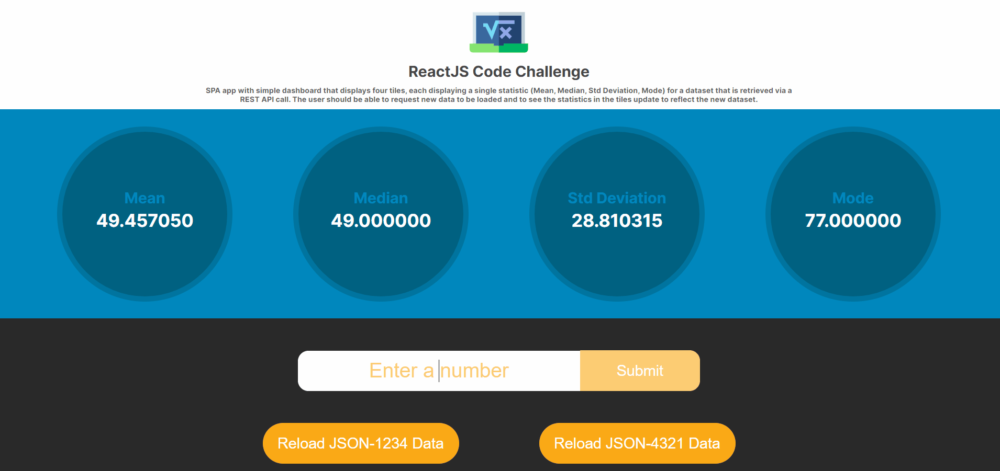

# ReactJS Coding Challenge

## Objective

Develop a Single Page App (SPA) that shows a simple dashboard that displays four tiles, each displaying a single statistic for a dataset that is retrieved via a REST API call. The user should be able to request new data to be loaded and to see the statistics in the tiles update to reflect the new dataset.

[Details about the Coding Challenge](src/docs/TandemReactJSChallenge.pdf 'Coding Challenge')

## Requirements

<ol>
  <li>The app shallbe implemented using ReactJS components and developed using either JavaScript or TypeScript, with the latter preferred.</li>
  <li>
  The app shall display four statistics tiles: Mean, Median,Standard Deviation and Mode.
  </li>
  <li>
  The app shall present a button which, when clicked, will cause a new dataset to be loaded(replacing the current dataset)and the dashboard display to be updated to reflect the newly loaded data.
  </li>
  <li>
  The app shall present an inputfield that will accept a number and a submit button which, when clicked, will cause the number to be addedto the currently loaded datasetand the dashboard tiles to update to reflect the new dataset state.
  </li>
</ol>

## Tech Stack

### Client Stack

<ul>
  <li>ReactJS (Javascript)</li>
  <li>React Hooks</li>
  <li>Custom React Hooks</li>
  <li>Styled Components</li>
  <li>Framer Motion</li>
  <li>Unit Tests
    <ul>
      <li>Jest</li>
      <li>React Testing Library</li>
    </ul>
  </li>
</ul>

### Server Stack (For Rest API Calls)

<ul>
  <li>Node</li>
  <li>Express</li>
  <li>Javascript</li>
  <li>Unit Tests
    <ul>
      <li>Jasmine</li>
    </ul>
  </li>
</ul>

## Scripts

### `npm run dev`

Runs both the server and the client concurrently in development mode. 
Server is listening on [http://localhost:3001](http://localhost:3001) (You will not be able to pull this up in a web browser directly) 
React app runs on [http://localhost:3000](http://localhost:3000)

### `npm run server`

Open [http://localhost:3001](http://localhost:3001) in a web browser to test your Rest API. The root path (http://localhost:3001/) will show you some brief documentation and version information.

### `npm run test`

Launches the test runner in the interactive watch mode. 
See the section about [running tests](https://facebook.github.io/create-react-app/docs/running-tests) for more information.
